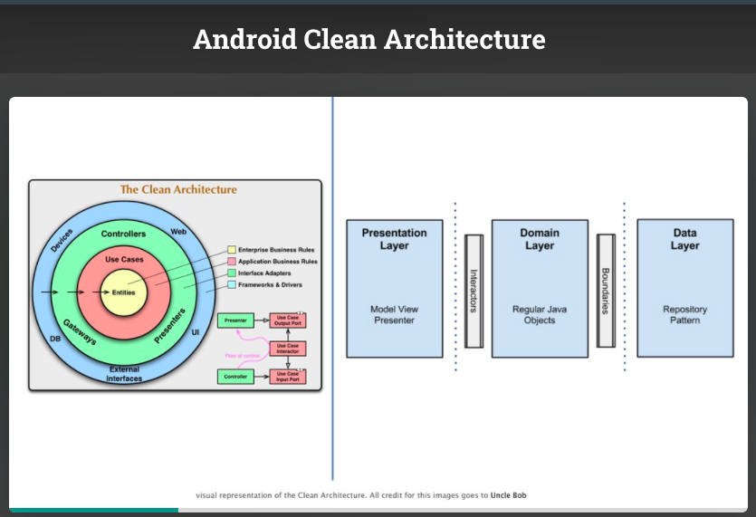
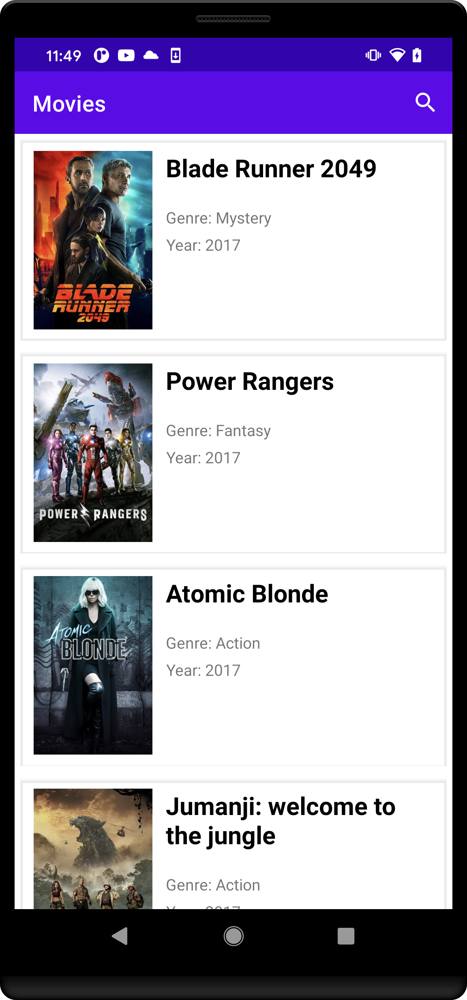
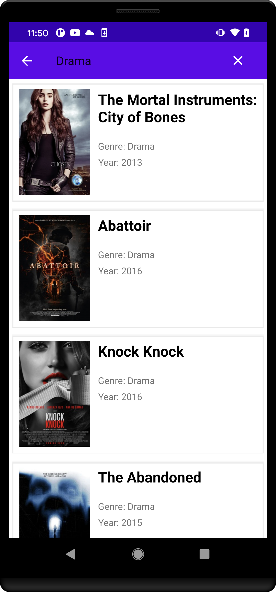

# News App

## About the app
I have created this small news app with simple UI to showcase my skills on how to create `Stable` app with proper `MVVM` and `Clean Architecture`. Also the project is using mock api response to show data on the UI. Launching screen will show the list of cat stories and user will be able to see the details of cat story when they tap into it.

## Code structuring approach
To build a good software architecture system that would be easy to understand, to develop, to maintain and to implement. We should follow modern architecture patterns like mentioned below:

1. `MVVM` helps us to separates our views (i.e. Activities and Fragments) from our business logic. MVVM is enough for small projects, but when our codebase becomes huge, our `View-Models` start bloating. Separating responsibilities becomes hard.

2. `MVVM` with `Clean Architecture` and `SOLID Principles` goes one step further in separating the responsibilities of our code base. It clearly abstracts the logic of the actions that can be performed in your app.
 
### CLEAN Architecture:

First of all the layers in `Clean architecture` has been separated into individual modules in a single Android project. For example android modules like `app`, `core`, `presentation`, `data` and `domain`. Notice the dependency of these modules, as per the dependency rule of `Clean architecture`, all the dependencies directly or indirectly point towards the the domain layer. The domain layer incorporates `Entities`, `Use-Cases` and interfaces required to cross boundaries, `Repository` in this case. The `Data` layer handles data and communicates with data source from `Remote` in this case `Mock` API, to provides required data requested by the `Presentation` layer. `View` layer will observe on the `presentation` layer's stateFlow object, to get the updated data on state change. Future I will create `Locale` data source to provide offline support for the app.

Having separate modules is not necessary, we can create all the layers in the app modules itself. Having separate modules and depending on the intended modules prevent accidental usage of a classes in unintended places. There are also couple of benefits mentioned below.

### Reason for using CLEAN architecture

- Our code will be even more easily testable than with plain MVVM
- Our code will be further decoupled
- The project will be even easier to maintain.
- Adding new features can be easy and quick.
- Dependencies can only point inwards (from concretions towards abstractions)
- The project will be point towards Stability
- Our code will point towards Abstractions

## Libraries

- **Kotlin-Coroutine-Flow**:for asynchronous task, reactive programming, mapping, transformation.
- **Hilt**: for Dependency Injection
- **Navigation-component**: for switching between fragments
- **Retrofit**: Netwoking Library with MockInterceptor
- **View-Binding**: for Accessing xml view ids
- **ViewModel**: For persisting data across configuration changes
- **Expresso, Mockk, Junit** - For testing
- **Glide** - for Image loading

## App screenshot

 
